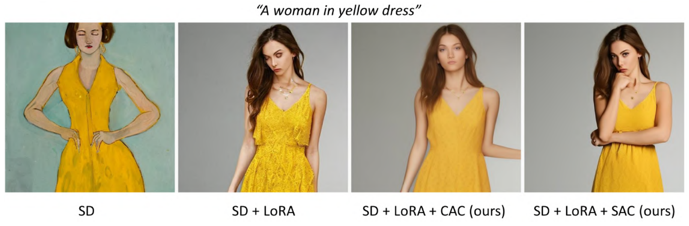
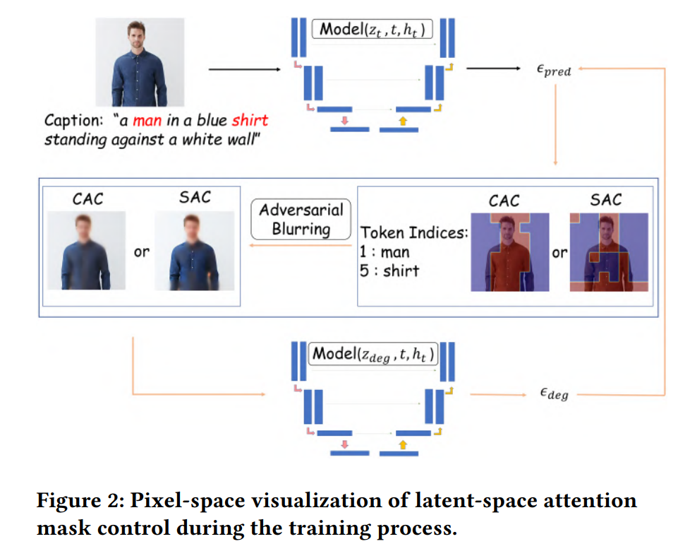

<h1 align="center">
	SAT: Self-Attention Control for Diffusion Models Training
</h1>

<div align="center">



SD: Stable Diffusion V1.5 \
Lora: Low Rank Adaption \
CAC: Cross-Attention Control \
SAC: Self-Attention Control
</div>

# Table of Contents

- [Table of Contents](#table-of-contents)
- [Main](#main)
- [Data](#data)
- [Training Methods](#training-methods)
- [Citation](#citation)
# Main
It was trained on `Model_Arts`\
Please check `main/run_train_text_image_lora_csag.py`\
attention_guide_type == "sag" or "cag"

# Data
we crop out the half-body human images with sizes 512 x 512, since we are more interested in human details such as faces and eyes.

# Training Methods



# Citation  

```bibtex
@inproceedings{10.1145/3607827.3616838,
author = {Huang, Jing and Zhang, Tianyi and Shi, Wei},
title = {SAT: Self-Attention Control for Diffusion Models Training},
year = {2023},
isbn = {9798400702839},
publisher = {Association for Computing Machinery},
address = {New York, NY, USA},
url = {https://doi.org/10.1145/3607827.3616838},
doi = {10.1145/3607827.3616838},
abstract = {Recent text-to-image diffusion models show outstanding performance in generating high-quality images conditioned on textual prompts. However, a persistent challenge lies in the generation of detailed images, especially human-related images, which often exhibit distorted faces and eyes. Existing approaches to address this issue either involve the utilization of more specific yet lengthy prompts or the direct application of restoration tools to the generated image. Besides, a few studies have shown that attention maps can enhance diffusion models' stability by guiding intermediate samples during the inference process. In this paper, we propose a novel training strategy (SAT) to improve the sample quality during the training process. To address this issue in a straightforward manner, we introduce blur guidance as a solution to refine intermediate samples, enabling diffusion models to produce higher-quality outputs with a moderate ratio of control. Improving upon this, SAT leverages the intermediate attention maps of diffusion models to further improve training sample quality. Specifically, SAT adversarially blurs only the regions that diffusion models attend to and guide them during the training process. We examine and compare both cross-attention mask control (CAC) and self-attention mask control (SAC) based on stable diffusion (SD) V-1.5, and our results show that our method under SAC (i.e SAT) improves the performance of stable diffusion.},
booktitle = {Proceedings of the 1st Workshop on Large Generative Models Meet Multimodal Applications},
pages = {15–22},
numpages = {8},
keywords = {training strategy, text-to-image diffusion model, lora, attention mask control},
location = {Ottawa ON, Canada},
series = {LGM3A '23}
}
```

For more work, please refer to [Academic Work](docs/ACADEMIC_WORK.md).